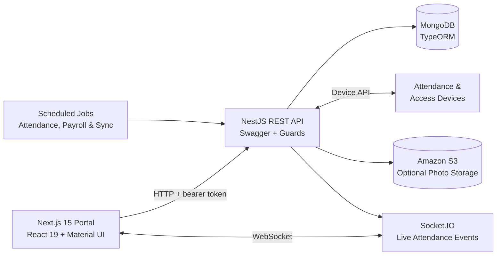

<div align="center">
  

  <h1>Smart Attendance System</h1>

  <p>
    A full-stack workforce attendance, access-control, and HR operations platform
    for multi-organization environments.
  </p>

  <p>
    
    
    
    
    
    
  </p>
</div>

## Overview

Smart Attendance System brings personnel, attendance, payroll, physical access, and connected-device workflows into one responsive administration portal. It supports organization, branch, and department scopes while giving each account access to only the data and actions allowed by its role and permissions.

The platform combines a Next.js dashboard with a modular NestJS API, MongoDB persistence, live Socket.IO events, scheduled processing, file-based data exchange, and optional Amazon S3 photo storage.

## Key Features

- **Live operations dashboard** — employee and blacklist totals, device connectivity, attendance status charts, pass trends, and latest access events.
- **Personnel management** — employee profiles, departments, blacklists, device assignments, bulk Excel/ZIP imports, exports, and photo handling.
- **Attendance workflows** — attendance points, groups, shifts, weekly working hours, cycle and temporary schedules, holidays, adjustments, rejected entries, and configurable attendance rules.
- **Reporting and payroll** — daily, weekly, and monthly reports grouped by organization, department, or person, with paginated results and CSV/XLSX exports.
- **Access control** — reusable time plans, person and device groups, access policies, exception lists, pass records, and device synchronization.
- **Multi-organization administration** — hierarchical organizations, branches, and departments with scope-aware filtering throughout the application.
- **Role and permission management** — role-based access plus granular IAM-style permission grants for protected UI actions and API endpoints.
- **Device operations** — device registration, status monitoring, remote commands, request queuing, person synchronization, and operation-job tracking.
- **Real-time updates** — Socket.IO attendance events and background data processing for responsive operational views.
- **System administration** — account management, custom export templates, operation logs, database synchronization settings, health checks, and interactive API documentation.

## Architecture



The backend is organized by business domain—authentication, personnel, attendance, access control, payroll, dashboard, operations, exports, and database synchronization. The frontend mirrors these domains with route-level pages, typed API modules, reusable components, and TanStack Query for server-state management.

## Technology Stack

### Frontend

- Next.js 15 App Router and React 19
- TypeScript
- Material UI and Emotion
- TanStack Query
- Recharts
- Socket.IO Client
- Day.js
- SheetJS, JSZip, and browser file APIs
- Notistack notifications

### Backend

- NestJS 10 and TypeScript
- MongoDB with TypeORM
- REST APIs with Swagger/OpenAPI
- Socket.IO WebSockets
- bcrypt authentication
- IAM-style roles, permission guards, and organization/branch/department scoping
- ExcelJS, Archiver, and Unzipper
- AWS SDK for Amazon S3
- node-cron scheduled processing

### DevOps and Tooling

- Multi-stage Docker builds
- Docker Compose
- ESLint
- npm lockfiles for reproducible installs
- Environment-specific staging and production builds
- Health and connectivity endpoints

## Getting Started

### Prerequisites

- Node.js 20 or newer
- npm
- MongoDB

### 1. Clone the repository

```bash
git clone <repository-url>
cd Attendance
```

### 2. Configure and run the backend

```bash
cd Backend/backend
npm install
```

Create `Backend/backend/.env`:

```env
PORT=3001
NODE_ENV=development
MONGO_URI=mongodb://localhost:27017/attendance
CORS_ORIGINS=http://localhost:3000

SEED_SUPER_ADMIN_USERNAME=admin
SEED_SUPER_ADMIN_PASSWORD=replace-with-a-strong-password

ENABLE_SWAGGER=true
SWAGGER_USER=admin
SWAGGER_PASSWORD=replace-with-a-strong-password
```

Start the API:

```bash
npm run start:dev
```

The backend creates the initial Super Admin account from the seed variables when the database does not already contain one.

### 3. Configure and run the frontend

Open a second terminal:

```bash
cd Frontend/frontend
npm install
```

Create `Frontend/frontend/.env.local`:

```env
NEXT_PUBLIC_API_URL=http://localhost:3001
NEXT_PUBLIC_WS_URL=http://localhost:3001
```

Start the web application:

```bash
npm run dev
```

Open [http://localhost:3000](http://localhost:3000) and sign in with the seeded administrator credentials.

## Useful Commands

| Application | Command | Purpose |
| --- | --- | --- |
| Frontend | `npm run dev` | Start the Next.js development server |
| Frontend | `npm run build` | Create a production build |
| Frontend | `npm run start` | Start the production server |
| Frontend | `npm run lint` | Run ESLint |
| Backend | `npm run start:dev` | Start NestJS with automatic reload |
| Backend | `npm run build` | Compile TypeScript to `dist/` |
| Backend | `npm run start` | Run the compiled API |

## API and Health Checks

With the backend running on port `3001`:

- Health status: [http://localhost:3001/health](http://localhost:3001/health)
- Connectivity check: [http://localhost:3001/ping](http://localhost:3001/ping)
- Swagger UI: [http://localhost:3001/api](http://localhost:3001/api)
- OpenAPI document: [http://localhost:3001/api-json](http://localhost:3001/api-json)
- Attendance WebSocket namespace: `http://localhost:3001/attendance`

Swagger is enabled for non-production environments and protected with the configured Swagger credentials.

## Optional Integrations

Amazon S3-backed employee photo storage can be enabled with:

```env
S3_BUCKET_NAME=your-bucket
S3_BUCKET_REGION=your-region
S3_ACCESS_KEY=your-access-key
S3_SECRET_ACCESS_KEY=your-secret-key
S3_PRESIGN_EXPIRES_SECONDS=3600
```

Connected attendance and access-control devices can be registered in the Device Management module. A default device endpoint can also be supplied through `DEVICE_IP`.

## Project Structure

```text
Attendance/
├── Frontend/
│   └── frontend/
│       ├── public/              # Brand and static assets
│       ├── scripts/             # Environment-aware build helpers
│       └── src/
│           ├── app/             # App Router pages and feature modules
│           ├── components/      # Shared UI components
│           ├── context/         # Authentication and scope contexts
│           ├── hooks/           # Reusable React hooks
│           └── lib/             # Typed API clients and utilities
└── Backend/
    └── backend/
        └── src/
            ├── access-control/  # Policies, devices, time plans, and passes
            ├── account/         # Accounts, roles, and permission grants
            ├── attendance/      # Processing, schedules, reports, and exports
            ├── auth/            # Authentication and authorization guards
            ├── dashboard/       # Operational metrics and trends
            ├── personnel/       # People, groups, departments, and imports
            ├── payroll/         # Payroll calculation and summaries
            ├── websocket/       # Live attendance event gateway
            └── main.ts          # API bootstrap and runtime configuration
```

## Engineering Highlights

- Domain-oriented backend modules keep a broad business workflow maintainable.
- Typed frontend API modules provide a consistent contract for queries, mutations, uploads, and downloads.
- Organization, branch, department, employee, and permission scopes are enforced across both navigation and API access.
- Large operational tasks expose progress through persistent operation jobs instead of blocking the interface.
- Attendance processing, payroll calculation, and database synchronization use scheduled services.
- Production builds use compact, multi-stage Docker images and runtime environment configuration.

