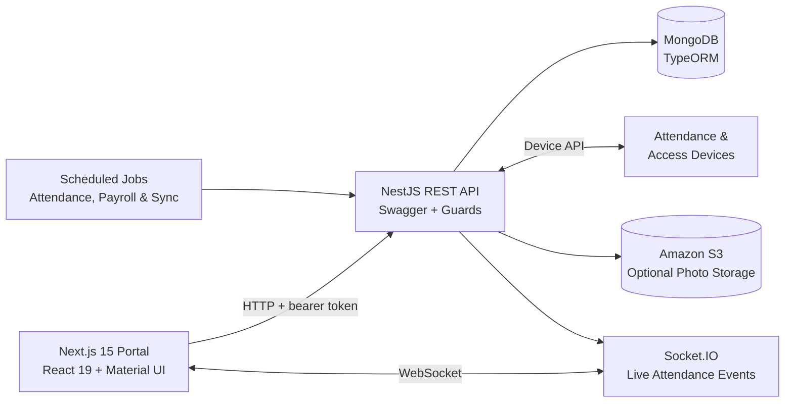

  <h1>Smart Attendance System</h1>

  

    A full stack workforce attendance, access control, and HR operations platform
    for multi organization environments.
  

  

    
    
    
    
    
    
  

> **Note:** This is a portfolio case study. Smart Attendance System is closed source, proprietary company work built at Rockville Technologies, so no source code is included here.

## Overview

Smart Attendance System brings personnel, attendance, payroll, physical access, and connected device workflows into one responsive administration portal. It supports organization, branch, and department hierarchies.

The platform combines a Next.js dashboard with a modular NestJS API, MongoDB persistence, live Socket.IO events, scheduled processing, file based data exchange, and optional Amazon S3 photo storage.

## Key Features

- **Live operations dashboard:** employee and blacklist totals, device connectivity, attendance status charts, pass trends, and latest access events.
- **Personnel management:** employee profiles, departments, blacklists, device assignments, bulk Excel/ZIP imports, exports, and photo handling.
- **Attendance workflows:** attendance points, groups, shifts, weekly working hours, cycle and temporary schedules, holidays, adjustments, rejected entries, and configurable attendance rules.
- **Reporting and payroll:** daily, weekly, and monthly reports grouped by organization, department, or person, with paginated results and CSV/XLSX exports.
- **Access control:** reusable time plans, person and device groups, access policies, exception lists, pass records, and device synchronization.
- **Multi organization administration:** hierarchical organizations, branches, and departments with scope aware filtering throughout the application.
- **Role and permission management:** role based access plus granular IAM style permission grants for protected UI actions and API endpoints.
- **Device operations:** device registration, status monitoring, remote commands, request queuing, person synchronization, and operation job tracking.
- **Real time updates:** Socket.IO attendance events and background data processing for responsive operational views.
- **System administration:** account management, custom export templates, operation logs, database synchronization settings, health checks, and interactive API documentation.

## Architecture

The backend is organized by business domain: authentication, personnel, attendance, access control, payroll, dashboard, operations, exports, and database synchronization. The frontend mirrors these domains with feature flags, permission checks, and organization scoped views.

## Technology Stack

### Frontend

- Next.js 15 App Router and React 19
- TypeScript
- Material UI and Emotion
- TanStack Query
- Recharts
- Socket.IO Client
- Day.js
- SheetJS, JSZip, and browser file APIs
- Notistack notifications

### Backend

- NestJS 10 and TypeScript
- MongoDB with TypeORM
- REST APIs with Swagger/OpenAPI
- Socket.IO WebSockets
- bcrypt authentication
- IAM style roles, permission guards, and organization/branch/department scoping
- ExcelJS, Archiver, and Unzipper
- AWS SDK for Amazon S3
- node cron scheduled processing

### DevOps and Tooling

- Multi stage Docker builds
- Docker Compose
- ESLint
- npm lockfiles for reproducible installs
- Environment specific staging and production builds
- Health and connectivity endpoints

## Core Workflows

### Attendance Lifecycle

1. Attendance and access devices submit pass events to the NestJS API.
2. Records are normalized and processed against employee, schedule, shift, holiday, and attendance rule data.
3. Live events are broadcast through the Socket.IO attendance namespace.
4. Dashboard metrics, attendance details, rejected entries, and reports reflect the processed results.
5. Scheduled services calculate attendance summaries and payroll data.

### Access Control Lifecycle

1. Administrators organize people and devices into reusable groups.
2. Time plans define weekly schedules and holiday periods.
3. Access policies connect person groups, device groups, and time plans.
4. Permission data and person profiles are synchronized with connected devices.
5. Pass records and device commands remain available for monitoring and export.

### Authorization Model

The system combines predefined roles with granular permission grants. Data access is scoped by organization, branch, department, and employee identity, allowing the same platform to serve system administrators, regional operations managers, HR staff, and security teams.

## Integration Capabilities

- Attendance and access control device APIs
- Socket.IO real time attendance events
- Amazon S3 employee photo storage
- Excel, CSV, and ZIP import/export workflows
- Scheduled attendance, payroll, and database synchronization
- Swagger/OpenAPI documentation
- Health, database, and connectivity monitoring

## Engineering Highlights

- Domain oriented backend modules keep a broad business workflow maintainable.
- Typed frontend API modules provide a consistent contract for queries, mutations, uploads, and downloads.
- Organization, branch, department, employee, and permission scopes are enforced across both navigation and API access.
- Large operational tasks expose progress through persistent operation jobs instead of blocking the interface.
- Attendance processing, payroll calculation, and database synchronization use scheduled services.
- Production builds use compact, multi stage Docker images and runtime environment configuration.
